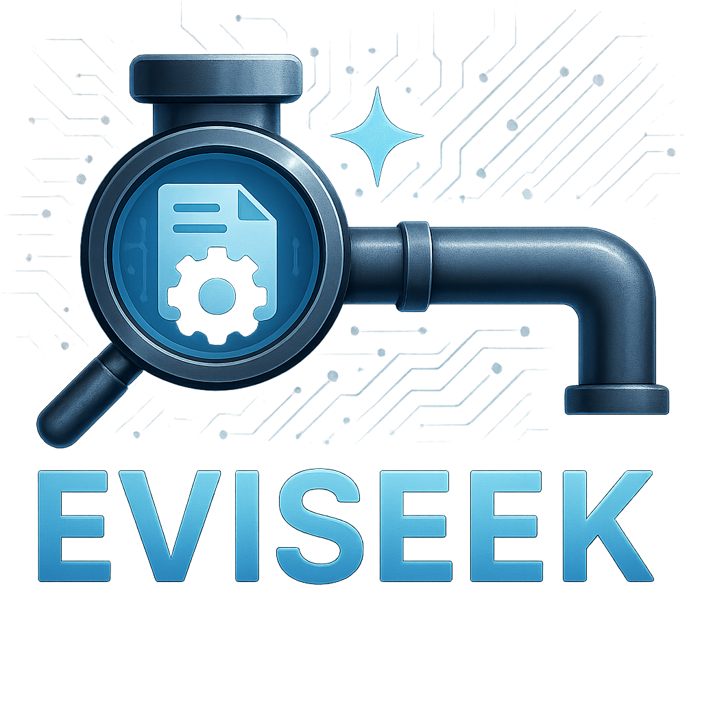

<!-- Logo -->

  

<!-- <h1 align="center">Assemblyline MCP</h1> -->

  Eviseek - An agentic pipeline that connects together SOC's via MCP-Servers! 
   
  <a href="#getting-started"><strong>Explore the docs »</strong></a>

  
  
  

